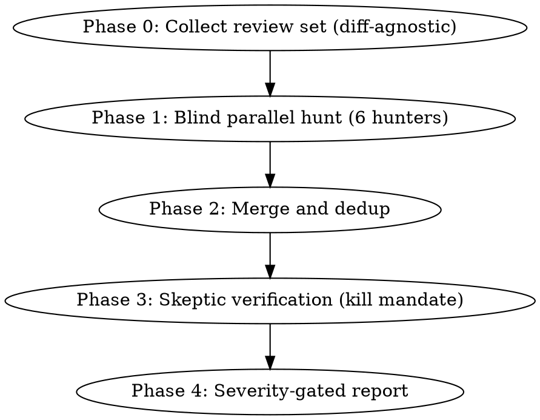

# Adversarial Review

## Overview

A multi-agent, adversarial code reviewer. Six specialized **hunter** agents each scan the review set for one family of problems, working blind and in parallel. Their findings are merged, deduplicated, and then handed to a **skeptic** agent whose only job is to kill them. Only findings that survive the skeptic are reported.

The design follows patterns proven in production reviewers (CodeRabbit, Cursor BugBot, Ellipsis, OpenAI CriticGPT — see [references/prior-art.md](references/prior-art.md)): one false positive costs more reviewer trust than one missed finding, so precision is engineered, not hoped for.

## When to Use

- Reviewing any code change: PR, branch, staged work, a commit range, a pasted diff
- Reviewing code that has no diff at all: a file, a directory, a whole module
- Post-implementation review before merging
- User asks to "review", "audit", or "find smells in" code

**When NOT to use:** Writing new code (use `writing-clean-code`). Behavior-changing feature work. Security audits (use a dedicated security review).

## Pipeline



## Phase 0: Collect the Review Set

The pipeline reviews a **review set**: a list of files, optionally narrowed to changed line ranges. Any of these sources produces one — a PR is just one mode:

| Mode | Trigger | Command sketch |
|------|---------|----------------|
| Pull request | "review this PR" / PR number given | `gh pr diff <n>` + `gh pr view <n>` |
| Branch diff | on a feature branch | `git diff <base>...HEAD` |
| Staged | "review what I'm about to commit" | `git diff --cached` |
| Working tree | uncommitted edits | `git diff HEAD` + untracked files |
| Commit range | "review the last 3 commits" | `git diff <A>..<B>` |
| Pasted diff / patch file | user supplies a diff | parse hunks directly |
| Files / directory | paths given, or no git repo | listed files, whole content |

Full commands, fallback order, and edge cases: [references/scope-collection.md](references/scope-collection.md).

When the set came from a diff, hunters focus findings on changed lines but may read surrounding code for context. When it is plain files, everything is in scope.

## Phase 1: Blind Parallel Hunt

Spawn one subagent per role, **all in a single message so they run in parallel**. Each subagent prompt = the role file body + the review set + its reference catalog path. Hunters never see each other's output — independent findings that agree are the strongest true-positive signal.

| Agent | Hunts | Catalog |
|-------|-------|---------|
| [bloater-hunter](agents/bloater-hunter.md) | Long Method, Large Class, Primitive Obsession, Long Parameter List, Data Clumps | [smells-bloaters.md](references/smells-bloaters.md) |
| [oo-abuser-hunter](agents/oo-abuser-hunter.md) | Switch Statements, Temporary Field, Refused Bequest, Alternative Classes | [smells-oo-abusers.md](references/smells-oo-abusers.md) |
| [change-preventer-hunter](agents/change-preventer-hunter.md) | Divergent Change, Shotgun Surgery, Parallel Inheritance Hierarchies | [smells-change-preventers.md](references/smells-change-preventers.md) |
| [dispensable-hunter](agents/dispensable-hunter.md) | Duplicate Code, Lazy Class, Data Class, Dead Code, Speculative Generality, Excessive Comments | [smells-dispensables.md](references/smells-dispensables.md) |
| [coupler-hunter](agents/coupler-hunter.md) | Feature Envy, Inappropriate Intimacy, Message Chains, Middle Man | [smells-couplers.md](references/smells-couplers.md) |
| [clean-code-reviewer](agents/clean-code-reviewer.md) | SOLID violations, naming, function shape, comments | [solid-violations.md](references/solid-violations.md) |

The agent files also work standalone: symlink them into `~/.claude/agents/` and invoke e.g. `@agent-bloater-hunter` directly.

### Finding contract

Every finding a hunter raises MUST carry all six fields. A finding missing any field is unfalsifiable and is dropped at merge, not debated.

```
- smell: <name> (<family>)
- location: <file>:<line-range>
- evidence: <quoted code, verbatim>
- harm: <concrete scenario — what change or bug this makes likely>
- fix: <named refactoring technique>
- confidence: <1-10>
```

## Phase 2: Merge and Dedup

The orchestrator (you) merges hunter reports:

1. Drop findings missing contract fields.
2. Merge findings citing the same location — keep the best-evidenced description, note which hunters agreed (`agreement: 2 hunters`).
3. Cap volume before verification: at most ~15 findings proceed; drop lowest-confidence Minor findings first and note the cap in the report.

## Phase 3: Skeptic Verification

Send every surviving finding to [finding-skeptic](agents/finding-skeptic.md) (batch related findings per file). The skeptic has a **kill mandate**: its job is to refute, not to double-check — a "please verify" prompt rubber-stamps; a "kill this" prompt filters.

Skeptic rules:

- **Re-open the evidence.** Read the cited file:lines fresh. A finding whose quoted code does not match the file dies.
- **Execution beats argument.** If a claim is checkable by running something (build, tests, `grep` for the alleged duplicate, counting parameters), run it instead of reasoning about it.
- **Verdicts:** `CONFIRMED` (with confidence 1–10), `REFUTED` (with the disproof), or `DOWNGRADED` (real but overstated — new severity).
- Findings that come back `REFUTED`, or `CONFIRMED` below 7/10, are dropped to the appendix.

## Phase 4: Report

Write to `./tmp/adversarial-review.md` (and summarize inline):

```markdown
# Adversarial Review: <scope description>

**Date:** YYYY-MM-DD · **Mode:** <branch diff | staged | files | ...>
**Files:** N · **Raised:** X findings · **Survived skeptic:** Y

## Critical   <!-- would block merge: broken contracts, LSP violations, real duplication -->
### <smell> — <file>:<lines>
Evidence · Harm · Fix · Skeptic: CONFIRMED (n/10) — <one line>

## Major      <!-- worth fixing now -->
## Minor      <!-- max 5 reported; abstention is valid -->

## Refuted (appendix)
- <finding> — killed because <one line>

## Summary
<one paragraph>
```

**"No findings" is a legitimate, expected outcome.** Never pad the report to justify the pipeline's existence.

## Design Principles (from prior art)

1. **Finder/skeptic split with a kill mandate** — verification is a distinct role prompted to refute.
2. **Evidence at generation time** — file:line + quoted code, or the finding doesn't exist.
3. **Execution beats argument** — a grep or a test ends debates that prompting cannot.
4. **Independence before consensus** — blind hunters; cross-hunter agreement is signal.
5. **False positives cost more than false negatives** — cap volume, drop low confidence, abstain freely.
6. **Refactoring preserves behavior** — any fix suggestion that changes behavior is out of scope.

Full research with sources: [references/prior-art.md](references/prior-art.md).

## Common Mistakes

| Mistake | Correction |
|---------|------------|
| Skeptic prompted to "double-check" | Prompt it to kill; rubber-stamping is the failure mode |
| Hunters sharing context | Run blind and parallel; correlation destroys the consensus signal |
| Flagging every pattern absence | Only suggest patterns that solve a problem present in the code |
| Ignoring the Rule of Three | Don't flag duplication on the second occurrence |
| Reviewing style instead of structure | Formatting is a linter's job |
| Findings without line numbers | Unfalsifiable; drop them at merge |
