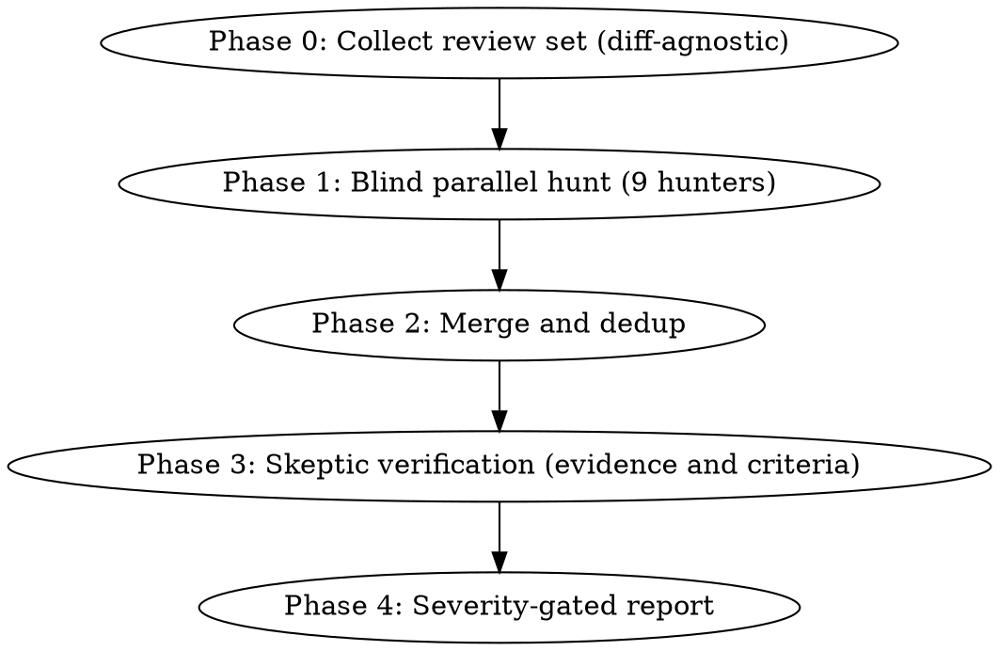

# Adversarial Review

## Overview

A multi-agent, adversarial code reviewer. Nine specialized **hunter** agents scan the review set: five smell families, SOLID, function clarity, module architecture, and function flow. They work independently, in parallel within available capacity. Their findings are merged, deduplicated, and handed to a **skeptic** that tries to disprove their evidence and reasoning. Substantiated findings survive; disproved findings are rejected.

The purpose is to find and report the smells defined in the catalogs. The skeptic enforces evidence quality; it does not replace those criteria with its own tolerance for code smells. Supported findings remain visible unless specifically disproved. An inconclusive check is reported as unresolved, not treated as a clean result.

The design draws on independent discovery and adversarial evidence checks used by production reviewers (see [references/prior-art.md](references/prior-art.md)). Precision comes from testing claims against the review criteria, not from suppressing supported findings.

## When to Use

- Reviewing any code change: PR, branch, staged work, a commit range, a pasted diff
- Reviewing code that has no diff at all: a file, a directory, a whole module
- Post-implementation review before merging
- User asks to "review", "audit", or "find smells in" code

**When NOT to use:** Writing new code (use `writing-clean-code`). Behavior-changing feature work. Security audits (use a dedicated security review).

## Pipeline



## Phase 0: Collect the Review Set

The pipeline reviews a **review set**: a list of files, optionally narrowed to changed line ranges. Any of these sources produces one — a PR is just one mode:

| Mode | Trigger | Command sketch |
|------|---------|----------------|
| Pull request | "review this PR" / PR number given | `gh pr diff <n>` + `gh pr view <n>` |
| Branch diff | on a feature branch | `git diff <base>...HEAD` |
| Staged | "review what I'm about to commit" | `git diff --cached` |
| Working tree | uncommitted edits | `git diff HEAD` + untracked files |
| Commit range | "review the last 3 commits" | `git diff <A>..<B>` |
| Pasted diff / patch file | user supplies a diff | parse hunks directly |
| Files / directory | paths given, or no git repo | listed files, whole content |

Full commands, fallback order, and edge cases: [references/scope-collection.md](references/scope-collection.md).

When the set came from a diff, hunters focus findings on changed lines but may read surrounding code for context. When it is plain files, everything is in scope.

## Phase 1: Blind Parallel Hunt

Spawn one subagent per role, in parallel up to available capacity; use waves when necessary. Complete all nine roles unless the user explicitly narrows the review. Each prompt includes the role body, review set, reference catalog path, and applicable user/repository standards. Resolve linked catalogs relative to the role file and supply accessible paths. Hunters never see other hunters' output or prior review conclusions. Track completed and incomplete roles; a missing role is incomplete coverage, not a clean result.

| Agent | Hunts | Catalog |
|-------|-------|---------|
| [bloater-hunter](agents/bloater-hunter.md) | Long Method, Large Class, Primitive Obsession, Long Parameter List, Data Clumps | [smells-bloaters.md](references/smells-bloaters.md) |
| [oo-abuser-hunter](agents/oo-abuser-hunter.md) | Switch Statements, Temporary Field, Refused Bequest, Alternative Classes | [smells-oo-abusers.md](references/smells-oo-abusers.md) |
| [change-preventer-hunter](agents/change-preventer-hunter.md) | Divergent Change, Shotgun Surgery, Parallel Inheritance Hierarchies | [smells-change-preventers.md](references/smells-change-preventers.md) |
| [dispensable-hunter](agents/dispensable-hunter.md) | Duplicate Code, Lazy Class, Data Class, Dead Code, Speculative Generality, Excessive Comments | [smells-dispensables.md](references/smells-dispensables.md) |
| [coupler-hunter](agents/coupler-hunter.md) | Feature Envy, Inappropriate Intimacy, Message Chains, Middle Man | [smells-couplers.md](references/smells-couplers.md) |
| [clean-code-reviewer](agents/clean-code-reviewer.md) | SOLID principles and substitutability | [solid-violations.md](references/solid-violations.md) |
| [function-clarity-hunter](agents/function-clarity-hunter.md) | Names, return contracts, dense expressions, guard rationale, effects | [clean-code-functions.md](references/clean-code-functions.md) |
| [module-architecture-hunter](agents/module-architecture-hunter.md) | Responsibilities, representation boundaries, validated domain types, state ownership | [clean-code-modules.md](references/clean-code-modules.md) |
| [function-flow-hunter](agents/function-flow-hunter.md) | Iteration depth, branching, call flow, artificial decomposition | [clean-code-function-flow.md](references/clean-code-function-flow.md) |

The agent files also work standalone: symlink them into `~/.claude/agents/` and invoke e.g. `@agent-bloater-hunter` directly.

The three clean-code documents are primary criteria for their dedicated hunters. Their coverage is required for procedural code too; the absence of classes or a function length below a bloat threshold is not an exemption. Apply the one-level iteration standard from the function-flow document, including nested inline collection callbacks. Preserve explicit user/repository overrides.

### Finding contract

Every finding a hunter raises MUST carry all six fields before it can be confirmed. Request missing evidence from its hunter; if it remains unavailable, list the candidate as unresolved with the missing field.

```
- smell: <name> (<family>)
- location: <file>:<line-range>
- evidence: <quoted code, verbatim>
- harm: <concrete scenario — what change or bug this makes likely>
- fix: <named refactoring technique>
- confidence: <1-10>
```

The three clean-code hunters also identify the applicable catalog section or explicit rule and propose a severity. Keep confidence separate from impact. Contract readability and concrete maintenance costs are valid findings even when existing callers are correct.

## Phase 2: Merge and Dedup

The orchestrator (you) merges hunter reports:

1. Check the finding contract; request missing fields or retain the candidate as unresolved, not confirmed.
2. Merge only findings about the same underlying problem and compatible fix, retaining all relevant evidence and hunter agreement. A naming mismatch, nested traversal, and boundary violation can share a function without being duplicates. Different criteria or required fixes remain distinct.
3. Bound verification batches to about 15 findings, prioritizing higher severity. If any candidates are deferred, list them as unverified in the report; a volume limit is not a refutation.

## Phase 3: Skeptic Verification

Send every surviving finding to [finding-skeptic](agents/finding-skeptic.md) (batch related findings per file). Supply the role body, review set, relevant catalogs, and applicable user/repository standards. The skeptic must try to disprove each finding rather than rubber-stamp it, without optimizing for rejection count.

**Preserve the review criteria when delegating.** This skill accepts concrete maintenance harm and plausible future change hazards grounded in existing code. Do not narrow it to current runtime failures or add a "present harm", "existing bug", or "failing test" requirement. Supply the three clean-code catalogs for findings based on them. Apply explicit limits, including the Long Method limit in [smells-bloaters.md](references/smells-bloaters.md) and the iteration-depth rule in [clean-code-function-flow.md](references/clean-code-function-flow.md); current correctness does not waive them.

Skeptic rules:

- **Re-open the evidence.** Read the cited file:lines fresh. A finding whose quoted code does not match the file dies.
- **Execution beats argument.** If a claim is checkable by running something (build, tests, `grep` for the alleged duplicate, counting parameters), run it instead of reasoning about it.
- **Verdicts:** `CONFIRMED` (with confidence 1–10), `REFUTED` (with a specific evidence-, scope-, or criterion-based disproof), `DOWNGRADED` (real but overstated — new severity), or `UNRESOLVED` (state the exact missing evidence).
- **Confidence is not severity.** Retain well-evidenced maintenance findings at an appropriate severity; do not dismiss them merely because they are not merge blockers.
- Only specifically refuted findings move to the Refuted appendix. Low-confidence or inconclusive candidates remain visible under Unresolved with the uncertainty and next check; do not silently suppress them with a confidence cutoff.

## Phase 4: Report

Write to `./tmp/adversarial-review.md` (and summarize inline):

```markdown
# Adversarial Review: <scope description>

**Date:** YYYY-MM-DD · **Mode:** <branch diff | staged | files | ...>
**Files:** N · **Raised:** X findings · **Survived skeptic:** Y
**Hunter coverage:** <completed roles; incomplete roles and reason, if any>

## Critical   <!-- would block merge: broken contracts, LSP violations, real duplication -->
### <smell> — <file>:<lines>
Evidence · Harm · Fix · Skeptic: CONFIRMED (n/10) — <one line>

## Major      <!-- worth fixing now -->
## Minor      <!-- summarize up to 5 inline; retain additional confirmed findings in the report -->

## Unresolved
<!-- Unverified/deferred candidates and missing evidence; omit if none. -->

## Refuted (appendix)
- <finding> — killed because <one line>

## Summary
<one paragraph>
```

**"No findings" is a legitimate outcome when no supported findings remain.** Never pad the report, but never claim a clean review while candidates remain unresolved/unverified or required hunter coverage is incomplete.

## Design Principles (from prior art)

1. **Finder/skeptic split with an adversarial mandate** — a distinct role attempts to disprove findings while retaining those supported by the review criteria.
2. **Evidence at generation time** — file:line + quoted code, or the finding doesn't exist.
3. **Execution beats argument** — a grep or a test ends debates that prompting cannot.
4. **Independence before consensus** — blind hunters; cross-hunter agreement is signal.
5. **Calibrated reporting** — refute with evidence, separate confidence from severity, and expose unresolved candidates rather than hiding them.
6. **Refactoring preserves behavior** — any fix suggestion that changes behavior is out of scope.

Full research with sources: [references/prior-art.md](references/prior-art.md).

## Common Mistakes

| Mistake | Correction |
|---------|------------|
| Skeptic rubber-stamps or maximizes rejections | Require an independent disproof attempt and an evidence-based verdict |
| Smells rejected because no current bug exists | Concrete maintenance harm and explicit limit violations are valid findings |
| Hunters sharing context | Run blind and parallel; correlation destroys the consensus signal |
| Flagging every pattern absence | Only suggest patterns that solve a problem present in the code |
| Ignoring the Rule of Three | Don't flag duplication on the second occurrence |
| Reviewing style instead of structure | Formatting is a linter's job |
| Calling misleading contracts or dense policy mere style | Apply the function-clarity criteria and identify the specific meaning a reader must reconstruct |
| Adding a class for every record, or dismissing all value classes | Inspect the invariant that construction establishes and preserves |
| Findings without line numbers | Request the location; otherwise expose the evidence gap as unresolved |
