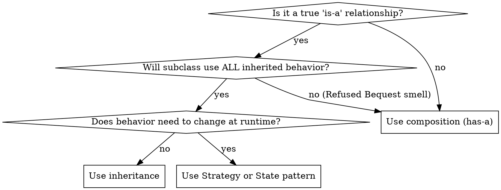

# Design Pattern Selection Guide

Use patterns to solve actual problems, not to demonstrate knowledge.

## When You Need to Create Objects

| Problem | Pattern | Signal |
|---------|---------|--------|
| Subclass decides which type to create | **Factory Method** | `new` scattered through code with type switches |
| Families of related objects needed together | **Abstract Factory** | Multiple factories that must stay in sync |
| Complex object needs step-by-step construction | **Builder** | Constructor with 5+ parameters or optional configs |
| Creating by cloning is cheaper | **Prototype** | Expensive initialization, many similar instances |

## When You Need to Structure Relationships

| Problem | Pattern | Signal |
|---------|---------|--------|
| Incompatible interface | **Adapter** | Legacy or third-party API doesn't match your interface |
| Abstraction and implementation vary independently | **Bridge** | Combinatorial explosion of subclasses |
| Tree structures, uniform treatment | **Composite** | Recursive part-whole hierarchies |
| Add behavior without subclassing | **Decorator** | Feature combinations would cause class explosion |
| Simplify complex subsystem | **Facade** | Clients need 5+ calls to do one thing |
| Many similar objects eating memory | **Flyweight** | Thousands of objects sharing common state |
| Control access or add lazy loading | **Proxy** | Need access control, caching, or logging transparently |

## When You Need to Manage Behavior

| Problem | Pattern | Signal |
|---------|---------|--------|
| Multiple handlers, unknown which processes | **Chain of Responsibility** | If-else chains checking handler type |
| Encapsulate requests for undo/queue/log | **Command** | Need to parameterize, queue, or undo operations |
| Traverse collection without exposing internals | **Iterator** | External code navigating internal data structure |
| Reduce chaotic cross-dependencies | **Mediator** | Many objects with tangled references |
| Save/restore state without breaking encapsulation | **Memento** | Undo/redo, checkpointing |
| Notify dependents of state changes | **Observer** | One-to-many: when X changes, Y and Z must update |
| Behavior changes based on state | **State** | Switch on state in multiple methods |
| Swap algorithms at runtime | **Strategy** | Switch on algorithm type; same interface, different behavior |
| Algorithm skeleton with customizable steps | **Template Method** | Subclasses override specific steps of a fixed process |
| Add operations without modifying element classes | **Visitor** | New operations on stable class hierarchy |

## Decision Flowchart: Inheritance vs Composition

